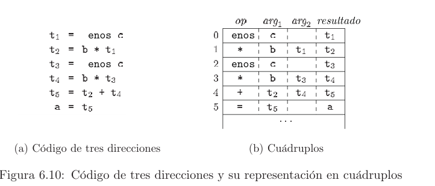
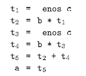
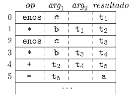

# Documentación

Se hace uso de los esquemas de traducción para armar un árbol sintáctico. Luego utilizar el patrón interprete para interpretar el `archivo de entrada`. La carpeta `src` se divide en:

### Archivo main.c
Contiene la ejecución principal y la construcción del ámbito padre ademas de realizar el primer `interpret` utilizando `recursividad indirecta`. 

### entriesTools
En esta carpeta se guardan los archivos de entrada para las herramientas flex y bison. Estos dos archivos se comunican a través de los encabezados generados por bison (`*.tab.h`), leer la documentación de cada herramienta para entender cada parte. Al finalizar el análisis sintáctico la raíz del arbol a utilizar en el patrón intérprete se guarda en producción del símbolo inicial de la gramatica.

### Context
Archivos de consumo para utilizar y guardar información en el proceso de interpretado, se envía en cada función `interpret` y puede agregar entradas a la tabla o árbol de ámbitos así como controlar la tabla de símbolos entre otra funcionalidad que se requiera en el proceso. Aquí se específica el archivo `result.h`.

### ast
La carpeta tiene el encabezado de la clase abstracta para implementar en todos los nodos terminales y no terminales del árbol sintáctico generado por el análisis sintáctico con bison. Tiene múltiples carpetas dividos por subcategorías de los componentes del lenguaje de entrada que implementan la clase abstracta.

## Compilación
Con el comando `make` ejecuta el archivo y busca todos los archivos con extensión c dentro de la carpeta definida en la variable `SRC`. Los pasos que el Makefile realiza son:

1. Crear la carpeta build, todos los compilados se generan en esta carpeta.
2. Generar el parser en c utilizando el archivo de entrada para bison en la carpeta `entriesTools` y con la opción para generar los encabezados `*.tab.h`
3. Generar el lexer en c utilizando el archivo de entrada para flex en la misma carpeta del paso anterior.
4. Compilar los archivos .c en las carpetas de la variable `SRC` a codigo objeto extensión .o
5. Compilar los archivos .c y .h de bison a código objeto (.o).
6. Compilar los archivos .c de flex a código objeto (.o).
7. Por último crear un único compilado en el archivo llamado `calc`.

## Ejecución

En la ruta `build/calc` tenemos el archivo compilado de nuestro proyecto, la función main recibe un argumento que es la ruta al `archivo de entrada`.

# Operaciones Aritmeticas
Se utilizan instrucciones de asignación y asignación unaria.

Entrada
~~~
b*-c+b*-c
~~~
Código de tres direcciones

Cuádruplos

# Operaciones relacionales
utilizar saltos condicionales, etiquetas, asignación y asignación unaria. Para guardar los resultados boolean se ve el tipo de la variable y si es boolean antes de ejecutar la expresion se crea un temporal con valor 1 y al finalizar en las etiquetas falsas se asigna a 0.

Entrada
~~~
a > b
~~~
Código de tres direcciones.
~~~
    t0 = 0
    if a > b goto L1
    goto L2
L1:
    t0 = 1
L2:
 //resto sentencias
~~~
Cuádruplos
|Operación                |Argumento 1| Argumento 2 | resultado
|-------------------------|-| ---|--|
|=|1||t0
|j>|a|b|L1
|=|0||t0
|label|||L1

# Operaciones lógicas
utilizar saltos anidados de las operaciones relacionales, código de corto circuito

~~~
a > 20 and b > 40 and c > 40
~~~
Código de tres direcciones.
~~~
    t0 = 0
    if a > 20 goto L1
    goto L2
L1: // sentencia verdadero
    if b > 40 goto L3
    goto L4
L3: //sentencia verdadero
    if c > 40 goto L5
    goto L6
L5: //sentencia verdadero
    t0 = 1
L2:
L4:
L6:
 // sentencias falsas
~~~

~~~
a > 20 or b > 40 or c > 40
~~~
Código de tres direcciones.
~~~
    t0 = 0
    if a > 20 goto L1
    goto L2
L2: // sentencia falso
    if b > 40 goto L3
    goto L4
L4: //sentencia falso
    if c > 40 goto L5
    goto L6
L6: //sentencia falso
    goto L7
L1:
L3:
L5:
 // sentencias verdadera
    t0 = 1
L7:
 // resto sentencias
~~~
